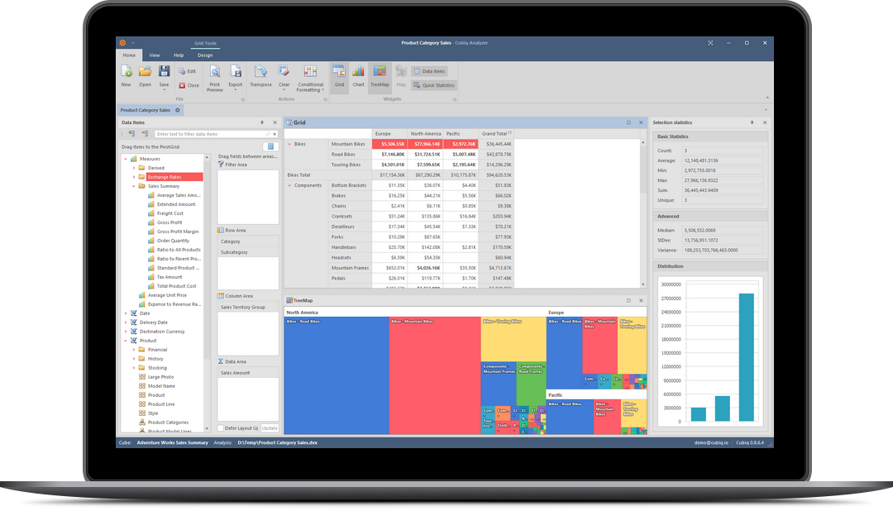
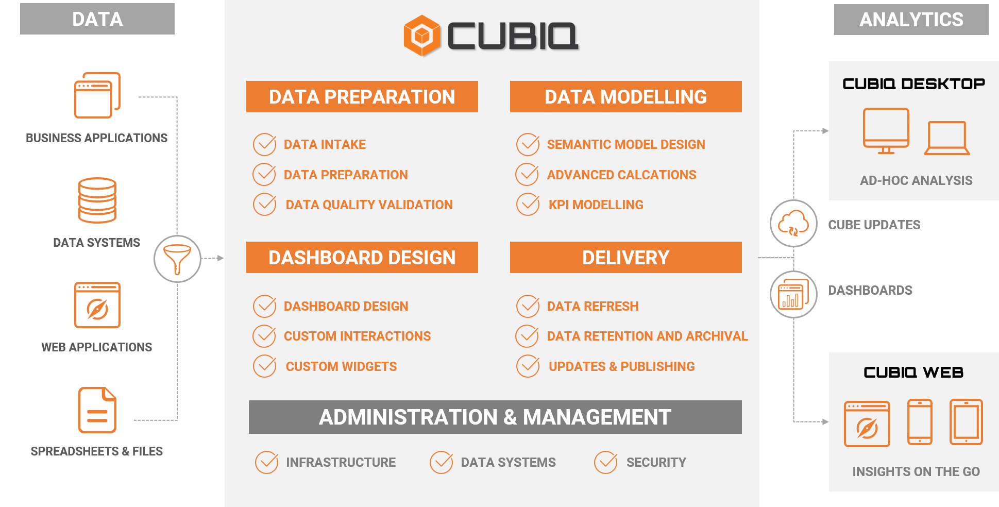

# CUBIQ BI Desktop

**CUBIQ BI** is a collection of software and data services, apps that work together to turn your data into coherent, visual and interactive insights. Cubiq BI is a full-service business intyelligence platform that differentiates itself from self-service tools by handling all aspects of your analytics needs - including data preparation and modelling.

## What is CUBIQ BI Desktop?

Windows desktop application for ad-hoc analysis, querying and data exploration

## What is CUBIQ BI?

**Full Service business intelligence and analytics.**

CUBIQ BI consists of a Windows desktop application called **CUBIQ BI Desktop**, and an online web application called the **CUBIQ Web**, underpinned by the fully managed service platform.

More info at [**CUBIQ BI Website**](cubiqbi.com)
